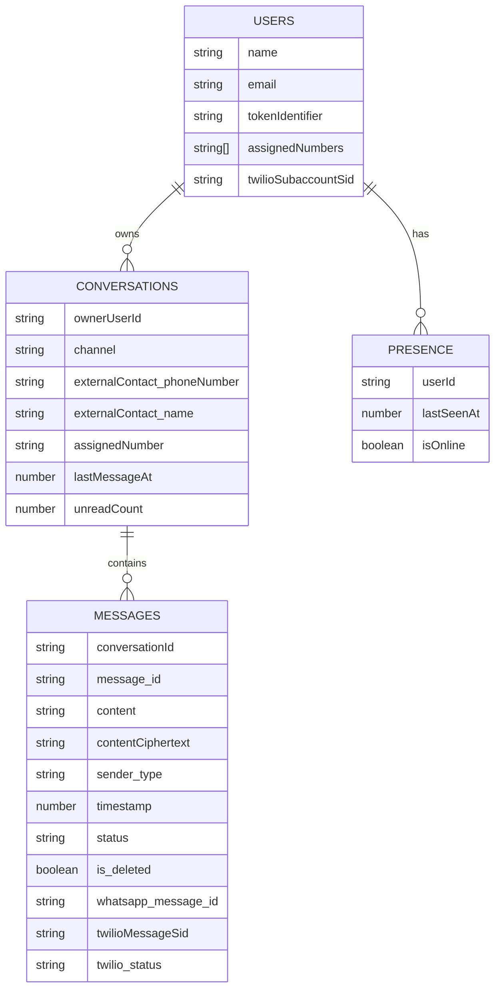

## Objetivo
Diseñar un modelo Convex multi-tenant (doctor = `users`) para chat estilo WhatsApp, con mensajes, conversaciones, no-leídos, estado, adjuntos, borrado permanente, retención, y soporte de webhooks Twilio.

## Modelo de Datos (Tablas)
### 1) `conversations`
- Propósito: representar cada “chat” de la lista (UI izquierda) y permitir búsqueda/orden por actividad.
- Campos propuestos:
  - `ownerUserId: v.id("users")` (doctor dueño)
  - `channel: v.union(v.literal("whatsapp"), v.literal("sms"), v.literal("inapp"))`
  - `externalContact: v.object({ phoneNumber: v.string(), name: v.optional(v.string()) })`
  - `assignedNumber: v.optional(v.string())` (número Twilio asignado del doctor; clave para enrutar inbound)
  - `lastMessagePreview: v.optional(v.string())`
  - `lastMessageAt: v.optional(v.number())` (ms epoch)
  - `unreadCount: v.number()` (para badge)
  - `lastReadAt: v.optional(v.number())` (puntero de lectura del doctor)
  - `isArchived: v.optional(v.boolean())`
  - `isBlocked: v.optional(v.boolean())`
- Índices:
  - `by_owner_lastMessageAt: ["ownerUserId", "lastMessageAt"]`
  - `by_owner_phone: ["ownerUserId", "externalContact.phoneNumber"]` (para búsqueda rápida por contacto)
  - `by_owner_assignedNumber: ["ownerUserId", "assignedNumber"]` (útil para UI/filtrado)

### 2) `messages`
- Propósito: histórico de mensajes dentro de una conversación.
- Campos requeridos (mapeados a Convex + metadatos):
  - `conversationId: v.id("conversations")`
  - `message_id: v.string()` (ID único lógico; recomendado: UUID generado en cliente/servidor para estabilidad + conciliación)
  - `content: v.optional(v.string())` (texto plano cuando no es sensible)
  - `contentCiphertext: v.optional(v.string())` (si `isSensitive=true`)
  - `encryption: v.optional(v.object({ alg: v.string(), keyId: v.string() }))`
  - `sender_type: v.union(
      v.object({ kind: v.literal("user"), user_id: v.id("users") }),
      v.object({ kind: v.literal("external"), phone_number: v.string(), name: v.optional(v.string()) })
    )`
  - `timestamp: v.number()` (ms epoch: hora exacta de envío/recepción; para UI absoluta)
  - `direction: v.union(v.literal("in"), v.literal("out"))`
  - `status: v.union(v.literal("queued"), v.literal("sent"), v.literal("delivered"), v.literal("read"), v.literal("failed"))`
  - `attachments: v.optional(v.array(v.object({
      kind: v.union(v.literal("image"), v.literal("audio"), v.literal("video"), v.literal("file")),
      url: v.optional(v.string()),
      storageId: v.optional(v.id("_storage")),
      mimeType: v.optional(v.string()),
      sizeBytes: v.number(),
      durationSeconds: v.optional(v.number()),
      width: v.optional(v.number()),
      height: v.optional(v.number())
    })))`
  - `is_deleted: v.boolean()`
  - `deletedAt: v.optional(v.number())`
  - `whatsapp_message_id: v.optional(v.string())` (si aplica)
  - `twilio_status: v.optional(v.string())` (raw status callback)
  - `twilioMessageSid: v.optional(v.string())` (MessageSid, clave para correlacionar callbacks)
- Índices:
  - `by_conversation_timestamp: ["conversationId", "timestamp"]` (paginación)
  - `by_conversation_creationTime: ["conversationId", "_creationTime"]` (alternativa)
  - `by_twilioMessageSid: ["twilioMessageSid"]` (status callbacks)
  - `by_message_id: ["message_id"]` (idempotencia)

### 3) `presence` (opcional pero recomendado para UI)
- Propósito: “Estado de conexión del usuario” (doctor) y trazabilidad.
- Campos:
  - `userId: v.id("users")`
  - `lastSeenAt: v.number()`
  - `isOnline: v.boolean()` (derivado o escrito por heartbeat)
- Índices:
  - `by_user: ["userId"]`

## Relaciones (ER)
- `users (1) -> (N) conversations` por `conversations.ownerUserId`
- `conversations (1) -> (N) messages` por `messages.conversationId`
- `messages.sender_type.kind=user -> users` por `sender_type.user_id` (opcional)
- `messages.sender_type.kind=external` referencia por valor (teléfono)

## Reglas de Negocio / Validación (antes de insertar)
- Validar E.164/WhatsApp: normalizar teléfonos (`+{country}{number}`) y para Twilio WhatsApp usar `whatsapp:+E164` a nivel integración.
- Idempotencia inbound: si llega `twilioMessageSid`/`whatsapp_message_id` repetido, no duplicar.
- Adjuntos: rechazar si `sum(sizeBytes) > MAX_BYTES` o si un archivo excede el máximo; validar `mimeType` permitido.
- `is_deleted=true`: redacción inmediata (opcional) → borrar `content`, `contentCiphertext`, `attachments` o dejarlos nulos, y conservar solo metadatos mínimos.

## WhatsApp/Twilio: sincronización bidireccional (triggers)
- Outbound:
  - `action sendMessage`: inserta mensaje con `queued`, envía a Twilio, guarda `twilioMessageSid` y actualiza `status`.
- Inbound:
  - `httpAction twilioWebhookInbound`: recibe mensaje entrante, verifica firma Twilio, resuelve `ownerUserId` por `To` contra `users.assignedNumbers`, upsert de `conversation` y insert de `message`.
- Status callbacks:
  - `httpAction twilioWebhookStatus`: actualiza `messages.status` y `twilio_status` por `twilioMessageSid`.

## Retención / Borrado permanente
- `mutation deleteConversation` o `deleteMessage`:
  - marca `is_deleted=true` y setea `deletedAt`.
  - no hay endpoint de “restore”.
- Retención automática:
  - `cron` (scheduled function) para purgar:
    - hard-delete mensajes con `is_deleted=true` y `deletedAt < now - X días`, o
    - hard-delete mensajes antiguos por política (ej. 90/180 días) según cumplimiento.

## Subscriptions / Realtime (UI)
- `listConversations(owner)` query ordenada por `lastMessageAt`.
- `getMessages(conversationId)` query paginada por `timestamp`.
- `watchUnreadCounts` se deriva de `conversations.unreadCount` (actualizado en mutations) para badge en tiempo real.
- Presencia: `heartbeat` mutation + query `getPresence(userId)` para “online/offline”.

## Ejemplos de Queries comunes
- Listado chats: `ctx.db.query("conversations").withIndex("by_owner_lastMessageAt", q => q.eq("ownerUserId", userId)).order("desc")...`
- Mensajes por conversación (paginación): `ctx.db.query("messages").withIndex("by_conversation_timestamp", q => q.eq("conversationId", id)).order("desc").take(N)`
- Buscar conversación por teléfono: `withIndex("by_owner_phone", q => q.eq("ownerUserId", userId).eq("externalContact.phoneNumber", phone))`
- Actualizar estado por Twilio SID: `withIndex("by_twilioMessageSid", q => q.eq("twilioMessageSid", sid)).unique()`

## Entregables (si confirmas este plan)
- Actualizar `convex/schema.ts` con `conversations`, `messages`, `presence` + índices.
- Crear `convex/chat.ts` (queries/mutations/actions) + validaciones.
- Crear `convex/http.ts` con webhooks Twilio (inbound + status) con verificación de firma.
- Añadir constantes de límites de adjuntos y utilidades de normalización de teléfono.
- Documento `docs/chat-convex.md` con diagrama ER (Mermaid) y ejemplos de queries.

## Diagrama ER (Mermaid) a incluir en la documentación

## Confirmación
Al confirmar, implemento el esquema y los módulos Convex correspondientes siguiendo este diseño.