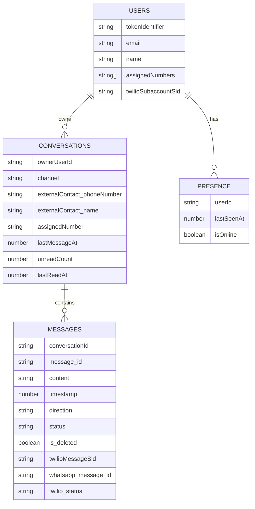

# Chat en Convex (WhatsApp vía Twilio)

Este documento describe el modelo de datos y los flujos backend implementados para el sistema de chat (UI en `app/chat/page.tsx`), con soporte de WhatsApp a través de Twilio.

## Tablas

### `users` (existente)

Relevante para chat/WhatsApp:
- `assignedNumbers: string[]` números E.164 que pertenecen al doctor (usados para enrutar inbound).
- `twilioSubaccountSid?: string` subcuenta Twilio del doctor (para enviar outbound).

### `conversations`

Representa un “chat” en la lista de conversaciones.
- `ownerUserId: Id<"users">` doctor dueño (multi-tenant).
- `channel: "whatsapp" | "sms" | "inapp"` canal.
- `externalContact: { phoneNumber: string; name?: string }` cliente externo (por WhatsApp).
- `assignedNumber?: string` número del doctor asociado al chat (para inbound/outbound).
- `lastMessagePreview?: string` preview para la UI.
- `lastMessageAt?: number` ms epoch para ordenar.
- `unreadCount: number` badge de no leídos.
- `lastReadAt?: number` puntero de lectura del doctor.
- `isArchived?: boolean`, `isBlocked?: boolean` flags UI.

Índices:
- `by_owner_lastMessageAt: ["ownerUserId","lastMessageAt"]`
- `by_owner_phone: ["ownerUserId","externalContact.phoneNumber"]`
- `by_owner_assignedNumber: ["ownerUserId","assignedNumber"]`

### `messages`

Mensaje dentro de una conversación.
- `conversationId: Id<"conversations">`
- `message_id: string` ID único lógico (ideal para idempotencia y conciliación).
- `content?: string` texto plano.
- `sender_type` union:
  - `{ kind: "user", user_id: Id<"users"> }`
  - `{ kind: "external", phone_number: string, name?: string }`
- `timestamp: number` ms epoch (base para hora absoluta/relativa).
- `direction: "in" | "out"`
- `status: "queued" | "sent" | "delivered" | "read" | "failed"`
- `attachments?: Attachment[]`
- `is_deleted: boolean`, `deletedAt?: number` borrado permanente lógico.
- `whatsapp_message_id?: string`, `twilioMessageSid?: string`, `twilio_status?: string` metadatos Twilio/WhatsApp.

Adjuntos (`attachments[]`):
- `kind: "image" | "audio" | "video" | "file"`
- `url?: string` URL pública (requerida si se envía vía Twilio).
- `storageId?: Id<"_storage">` (si se usa Convex File Storage).
- `mimeType?: string`
- `sizeBytes: number`
- `durationSeconds?: number`, `width?: number`, `height?: number`

Índices:
- `by_conversation_timestamp: ["conversationId","timestamp"]` (paginación/orden).
- `by_twilioMessageSid: ["twilioMessageSid"]` (status callbacks).
- `by_message_id: ["message_id"]` (idempotencia).

### `presence`

Presencia del doctor (para “estado de conexión del usuario”).
- `userId: Id<"users">`
- `lastSeenAt: number`
- `isOnline: boolean` (en UI se deriva con ventana de 30s)

Índice:
- `by_user: ["userId"]`

## Relaciones (ER)



## Realtime / Subscriptions

Convex actualiza en tiempo real cuando cambia el resultado de una query.
- Lista de chats: `chat.listConversations` (ordenada por `lastMessageAt`).
- Mensajes: `chat.getMessages` (paginación por `beforeTimestamp`).
- Badge no leídos: `conversations.unreadCount` se actualiza al llegar mensajes inbound y se limpia con `chat.markConversationRead`.

## WhatsApp vía Twilio (sincronización bidireccional)

### Outbound (doctor -> paciente)
- Action: `chatActions.sendWhatsAppMessage`
  1) Inserta un `messages` con `status="queued"`.
  2) Envía a Twilio (`/Accounts/{SubaccountSid}/Messages.json`).
  3) Persiste `twilioMessageSid`/`whatsapp_message_id` y estado.
  4) Actualiza `conversations.lastMessageAt/lastMessagePreview`.

### Inbound (paciente -> doctor)
- HTTP webhook: `POST /twilio/whatsapp/inbound` en Convex (ver `convex/http.ts`).
  1) Verifica firma `X-Twilio-Signature`.
  2) Resuelve `ownerUserId` por `To` contra `users.assignedNumbers`.
  3) Upsert de conversación + insert del mensaje inbound.
  4) Incrementa `unreadCount` y actualiza `lastMessageAt/lastMessagePreview`.

### Status callbacks (Twilio)
- HTTP webhook: `POST /twilio/whatsapp/status`
  - Actualiza `messages.status` y `twilio_status` por `twilioMessageSid`.

## Borrado y retención

- Borrado permanente lógico: `messages.is_deleted=true` + `deletedAt`.
- Sin recuperación: no existe endpoint de restore.
- Retención automática (recomendado): agregar una función programada (cron) que haga hard-delete de mensajes antiguos o ya borrados lógicamente.

## Encriptación de mensajes sensibles

Implementación recomendada (sin romper búsquedas/orden):
- Encriptación en el cliente (WebCrypto) antes de insertar.
- Persistir `contentCiphertext` y `encryption.{alg,keyId}` y dejar `content` vacío.
- Rotación de claves por usuario (keyId) y gestión de llaves fuera de Convex (p.ej. KMS o llaves derivadas + envoltura con credenciales del usuario).

## Límites de adjuntos

En `convex/chatConfig.ts`:
- Máximo de adjuntos por mensaje.
- Máximo tamaño por adjunto y total.
- Lista de `mimeType` permitidos.

## Ejemplos de queries comunes

### Listar chats del usuario (ordenados por actividad)

```ts
import { query } from "./_generated/server";

export const listConversations = query({
  args: {},
  handler: async (ctx) => {
    // ver implementación en convex/chat.ts
  },
});
```

### Mensajes por conversación (paginación)

```ts
import { query } from "./_generated/server";
import { v } from "convex/values";

export const getMessages = query({
  args: {
    conversationId: v.id("conversations"),
    limit: v.optional(v.number()),
    beforeTimestamp: v.optional(v.number()),
  },
  handler: async (ctx, args) => {
    // ver implementación en convex/chat.ts
  },
});
```

### Buscar conversación por teléfono

```ts
await ctx.db
  .query("conversations")
  .withIndex("by_owner_phone", (q) =>
    q.eq("ownerUserId", ownerUserId).eq("externalContact.phoneNumber", phoneE164),
  )
  .collect();
```

### Actualizar estado por Twilio SID

```ts
await ctx.db
  .query("messages")
  .withIndex("by_twilioMessageSid", (q) => q.eq("twilioMessageSid", messageSid))
  .unique();
```

